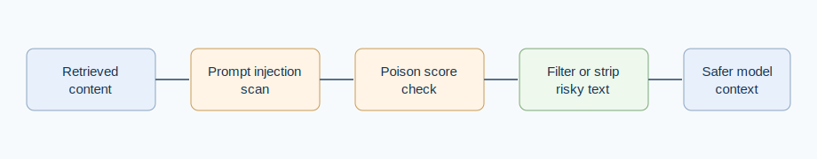

# Small-Rule Guardrails for Retrieval-Augmented Generation: Prompt Injection and Vector Poisoning Checks

Mukunda Rao Katta

## Abstract

Retrieval-augmented generation systems often treat retrieved text as helpful evidence, but retrieved text can also contain adversarial instructions, suspicious link patterns, oversized chunks, or secret-exfiltration requests. This paper presents a small-rule guardrail approach implemented through two zero-dependency JavaScript packages: prompt-injection-shield and vector-poison-score. The method is deliberately lightweight. It scans retrieved documents and tool outputs before they are inserted into model context, reports explicit risk reasons, and supports filtering or line stripping as a simple containment step. The contribution is not a replacement for full security review or large-scale benchmark evaluation. Instead, it offers an inspectable baseline that developers can place between retrieval and prompt construction while building, testing, and auditing agentic RAG workflows.

## 1. Motivation

RAG systems make model outputs more grounded by adding external material to the prompt. That same design also expands the trust boundary. Web pages, emails, documents, and tool outputs can carry instructions that were never meant to be followed by the model. Prior work on indirect prompt injection shows that LLM-integrated applications can be manipulated by malicious content fetched from outside the immediate user conversation [@greshake2023not; @liu2023prompt]. RAG pipelines also face poisoning risks when retrieval indexes contain adversarial or low-quality material [@zou2024poisonedrag].

For many development teams, the first useful defense is not a large security platform. It is a small, auditable check that makes risk visible before a retrieved chunk becomes model context. This paper describes that baseline.

## 2. Implementation Basis

The paper is grounded in two packages from the `ai-problem-packages` repository.

- `prompt-injection-shield` scans text for instruction override language, role changes, secret exfiltration requests, hidden-instruction patterns, and tool-abuse language.
- `vector-poison-score` scores retrieved documents for instruction-like payloads, link-farm behavior, and oversized chunks.

Both packages are intentionally small. They do not claim semantic completeness. They provide deterministic signals that can be inspected, tested, and tuned.

*Figure 1. Lightweight RAG guardrail workflow before model-context construction.*

## 3. Method

The guardrail sits between retrieval and prompt construction. Each candidate chunk is scanned before it is passed to the model. The prompt-injection scanner returns a safety flag, a total risk score, and a list of findings. The vector poisoning check returns whether a document is poisoned, a score, and the reasons that contributed to the score.

The workflow has four practical properties.

- It is deterministic, so a given input produces the same finding every time.
- It is inspectable, so every score is accompanied by a reason.
- It is cheap enough to run during local development and CI checks.
- It is conservative, because it is designed to flag risk rather than prove safety.

## 4. Review Dimensions

| Dimension | What it checks | Example signal | Practical use |
| --- | --- | --- | --- |
| Instruction override | Attempts to replace system or developer instructions | "ignore previous instructions" | keep retrieved text from becoming control text |
| Secret exfiltration | Requests to print or send sensitive values | "reveal the API key" | block prompt-to-secret pathways |
| Tool misuse | Language that asks the model to call risky tools | "use shell to delete" | force human review before tool execution |
| Link saturation | Too many external links in one chunk | repeated URLs | reduce link-farm retrieval noise |
| Oversized chunks | Unusually long retrieved material | very large document body | keep context windows maintainable |

## 5. Limits

Small-rule systems miss adversarial paraphrases and domain-specific attacks. They also produce false positives when benign documentation describes attacks. These limits are acceptable when the system is used as a first-pass development guardrail rather than as a final security boundary. Higher-risk deployments should combine these checks with retrieval provenance, access-control filters, red-team corpora, model-level evaluation, and human review.

## 6. Conclusion

Small guardrails are useful when they make risk visible early. The packages described here turn prompt-injection and vector-poisoning concerns into explicit, testable checks that can be placed in ordinary RAG and agent workflows. Their value is not that they solve RAG security. Their value is that they give builders a simple baseline before retrieved text becomes trusted model context.

## References

References are provided in `paper.bib`.

